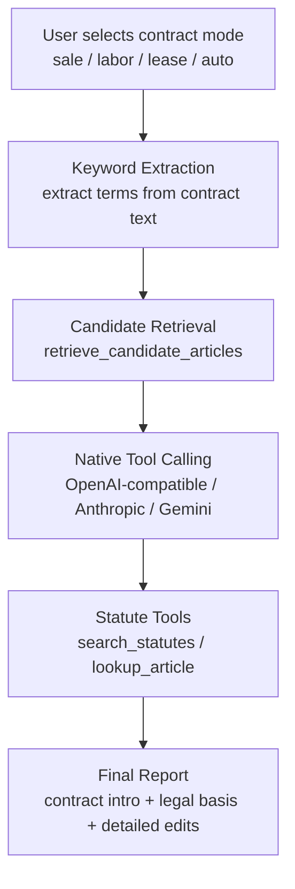
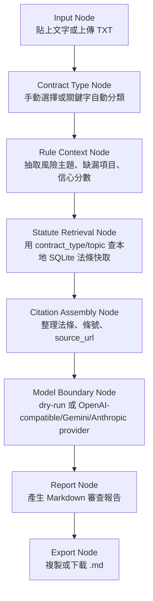

# Legal Contract Assistant

台灣合約審查本機 Agent。支援買賣、勞動、租賃三類合約，使用本地 SQLite 法條與審查規則產生可追溯的 Markdown 風險報告，並提供 FastAPI + React GUI。

中文備註：這份 README 是 GitHub 首頁文件，主要給開發者、評估者和進階使用者看。一般使用者下載 zip 後，請優先打開 `START_HERE.zh-TW.md`；完整中文操作說明請看 `USER_GUIDE.zh-TW.md`；架構與里程碑請看 `docs/overview.md`。

> This tool is for preliminary contract risk review only. It is not legal advice.

## Features

中文備註：這一段是功能摘要。重點是本機 GUI、dry-run、不填 API key 也能跑、API key 只存在本機 `.env`、報告會附法條引用與來源 URL。

- Local GUI: FastAPI serves a React interface at `http://127.0.0.1:8787`.
- Contract modes: sale, labor, lease, or no specified mode.
- Input methods: paste text or upload `.txt`.
- Local dry-run: generate reports without API keys or external network calls.
- Optional LLM providers: OpenAI, OpenRouter, llama.cpp, Ollama, Anthropic, and Gemini.
- Model picker: choose a common model from the provider list or type a custom model name.
- Long contract mode: use the provider's high-output preset and show a warning when the model stops because of a length limit.
- API key handling: keys are saved only to local `.env` and shown as masked values in the GUI.
- Traceable output: reports include related statutes, source URLs, risk themes, missing items, and disclaimer.
- Package workflow: build a timestamped zip release with PowerShell.

## Interview Demo Notes

中文備註：這一段是面試展示用。建議你用「本機 GUI Agent + 可追溯法條檢索 + 可替換模型 provider」作為主軸，展示你不是只包一層 LLM，而是有資料層、規則層、模型邊界與發布流程。

30 秒介紹：

```text
這是一個本機版台灣合約審查 Agent。使用者可以選擇買賣、勞動、租賃或不指定模式，貼上合約文字後，系統會先用本地法條快取與審查規則建立結構化審查上下文，再選擇 dry-run 或 LLM provider 產生 Markdown 報告。報告會附上法條引用、來源 URL、風險主題、缺漏事項與免責聲明。
```

面試 Demo 流程：

1. 啟動 GUI：執行 `.\start-gui.ps1` 或雙擊 `start-gui.vbs`。
2. 選擇合約模式：例如 `租賃合約`。
3. 選擇審查立場：中立、甲方或乙方。
4. 貼上一小段合約文字，先不要勾選 API 模型。
5. 產生 dry-run 報告，展示不用 API key 也能輸出法條引用、合約簡介與立場化修改建議。
6. 切換甲方/乙方立場，展示甲方有可貼入合約的修改範例，乙方有維護權益與談判提醒。
7. 打開報告中的法條來源 URL，說明每個引用都可追溯。
8. 切到 Ollama、llama.cpp、Gemini 或 OpenRouter，展示模型 provider 可替換。
9. 說明 `.env` 只保存在本機，不回顯完整 API key。
10. 說明 release zip 只包含執行必要檔案，不包含測試資料與 `.env`。

## Workflow Nodes

## MCP and Tool Calling Architecture

中文備註：目前法條檢索已經被包成可復用工具層，GUI、CLI、MCP server、LLM tool calling 都使用同一組檢索能力。這是面試時展示「不是只把合約丟給 LLM」的重點。

Current retrieval/tool flow:



- `search_statutes(query, contract_mode, limit)` is the low-level cached statute search tool.
- `retrieve_candidate_articles(contract_text, contract_mode, limit)` is the high-level retrieval workflow that extracts keywords, searches, merges, and ranks candidates.
- `lookup_article(law_name, article_no)` is the exact citation lookup tool.
- MCP exposes the same tools through `src/legal_contract_assistant/mcp_server.py`.
- Native tool calling is implemented in the LLM providers; models may request tool calls, but the backend executes tools and returns results.
- The GUI does not show workflow trace by default; API responses include candidate articles and tool call count for tests and demos.
- `auto` means no user-selected mode. The app no longer auto-classifies contract type in the main review path.

中文備註：這是 Agent 工作流節點化展示。面試時可以把每個節點當成一個工程設計點，而不是只說「丟給 LLM」。



節點說明：

- `Input Node`：目前只支援純文字與 `.txt`，避免 PDF/OCR 先增加不穩定因素。
- `Contract Type Node`：支援 `sale`、`labor`、`lease`、`auto`，後續可替換成更完整分類器。
- `Rule Context Node`：先用本地規則整理風險，不讓 LLM 自由發揮。
- `Statute Retrieval Node`：先查本地快取，確保測試不依賴網路。
- `Citation Assembly Node`：把法條引用與 URL 放進上下文，讓報告可追溯。
- `Model Boundary Node`：LLM provider 是邊界，不是核心資料來源；沒有 API key 時仍可 dry-run。
- `Report Node`：輸出固定 Markdown 結構，包含法條、缺漏、人工確認與免責聲明。
- `Export Node`：GUI 支援複製與下載 `.md`，方便交付報告。

## Statute Retrieval Method

中文備註：這是法條檢索方法展示。重點是 cache-first，而不是每次都即時查網路。

核心類別：

- `ContractStatuteCache`：SQLite 快取層，負責建表、seed 法條、依條號/topic/contract_type 查詢。
- `StatuteLookupService`：查詢決策層，負責「先查快取，必要時才 live fallback」。
- `MojLawClient`：即時查詢全國法規資料庫的邊界，目前不是 dry-run 主流程的必要條件。

檢索流程：

1. 系統初始化 SQLite：建立 `statute_articles`、`review_rules` 等資料表。
2. seed 合約相關法條：買賣、勞動、租賃常用條文寫入本地快取。
3. 審查時根據合約類型查詢：例如 `search_by_contract_type("lease")`。
4. 若風險規則命中特定主題，再查：例如 `search_by_contract_and_topic("lease", "deposit")`。
5. 報告只引用 `related_articles` 中的法條，避免模型自行捏造法條。
6. 若未來啟用 live fallback，快取 miss 時才查全國法規資料庫，並把結果寫回 SQLite。

這個設計的好處：

- 測試穩定：pytest 不需要網路。
- 可追溯：每條法條有 `law_name`、`article_no`、`text`、`source_url`。
- 可控：LLM 只能使用傳入的 `related_articles`，不能自由發揮法源。
- 可擴充：新增合約類型時，只要補 seed 法條、topic 和 review rules。

## Requirements

中文備註：一般使用者只需要 Windows + Python。只有開發者要重建前端時才需要 Node.js/npm。

For normal packaged GUI use:

- Windows 10/11
- Python 3.11+

For development or rebuilding the frontend:

- Node.js 20.19+
- npm

The packaged release includes `frontend/dist`, so end users usually do not need Node unless the frontend build is missing or they want to rebuild it.

## Quick Start

中文備註：下載 release zip 的使用者，請先看 `START_HERE.zh-TW.md`。開發者 clone GitHub repo 後，可以直接用 `start-gui.ps1` 啟動。

If you downloaded a release zip, unzip it and open:

```text
START_HERE.zh-TW.md
```

For Windows GUI launch, double-click:

```text
start-gui.vbs
```

If double-click launch fails, use PowerShell:

```powershell
Set-ExecutionPolicy -Scope Process -ExecutionPolicy Bypass
.\start-gui.ps1
```

If port `8787` is already in use, the script opens the existing local URL instead of starting a second server. Stop the old PowerShell process with `Ctrl+C` before restarting.

Clone the repository:

```powershell
git clone https://github.com/jason87216/legal-contract-assistant.git
cd legal-contract-assistant
```

Start the local GUI from PowerShell:

```powershell
.\start-gui.ps1
```

For a double-click launch on Windows, run:

```text
start-gui.vbs
```

Use `start-gui.ps1` when you need to see logs for debugging.

Open the browser if it does not open automatically:

```text
http://127.0.0.1:8787
```

First test without an API key:

1. Select `租賃合約`.
2. Select `甲方立場` if you want clause examples for Party A, or `乙方立場` if you want rights-preservation advice for Party B.
3. Paste:

```text
甲方為出租人，乙方為承租人。乙方每月支付租金，房屋修繕由雙方約定。
```

4. Do not check `使用 API 模型產生報告`.
5. Click `產生審查報告`.

Expected result: a Markdown report containing `合約審查報告`, a contract introduction, statute citations, source URLs, detailed edit suggestions, perspective-specific advice, and disclaimer.

## API Key Settings

中文備註：遠端模型需要 API key；Ollama 與部分 llama.cpp 本機模型通常可以不填。合約內容會送到你選擇的遠端模型服務，敏感合約請優先使用 dry-run 或本機模型。

The GUI supports:

- OpenAI
- OpenRouter
- llama.cpp
- Ollama
- Anthropic
- Gemini

Settings are stored in a local `.env` file in the project folder. This file is ignored by Git and is not included in release zips.

For llama.cpp, the default base URL is:

```text
http://127.0.0.1:18080/v1
```

The default local model name is:

```text
local-chat
```

If your llama.cpp server does not require a real key, you may use:

```text
sk-no-key-required
```

For Ollama, the default OpenAI-compatible base URL is:

```text
http://localhost:11434/v1
```

Ollama requires an API key field for OpenAI-compatible clients, but the value is ignored. This app uses `ollama` automatically when no key is saved. Set the model name to a model already available in your local Ollama installation, such as `qwen3:8b`.

Anthropic uses the Messages API. Gemini uses the Gemini `generateContent` API. Both are non-streaming in this MVP.

If a model produces only part of a report, enable `長合約模式`. Normal mode requests `8192` output tokens; long contract mode uses the provider's high-output preset in this tool. Free models may still be capped by the provider. When the provider reports a length stop such as `length`, `max_tokens`, or `MAX_TOKENS`, the GUI shows the stop reason and a visible warning.

## MCP Server Usage

中文備註：MCP server 是給支援 MCP 的 agent/client 使用的法條工具介面；一般 GUI 使用者不需要啟動它。

Install dependencies from `requirements.txt`, then run:

```powershell
python -m src.legal_contract_assistant.mcp_server
```

The MCP server exposes:

- `lookup_article`
- `search_statutes`
- `retrieve_candidate_articles`

These tools are backed by the same local SQLite statute cache used by the GUI.

## CLI Usage

中文備註：CLI 主要給開發者測流程。一般使用者建議使用 GUI，不需要記命令列參數。

Generate a dry-run report:

```powershell
python -m src.legal_contract_assistant.main --contract-type lease --text "甲方為出租人，乙方為承租人。乙方每月支付租金，房屋修繕由雙方約定。"
```

Use local llama.cpp:

```powershell
python -m src.legal_contract_assistant.main --contract-type lease --use-local-llama --model-provider llama.cpp --model local-chat --model-base-url http://127.0.0.1:18080/v1 --text "甲方為出租人，乙方為承租人。乙方每月支付租金，房屋修繕由雙方約定。"
```

## Build Release Zip

中文備註：這是發布者使用的打包命令，不是一般使用者啟動命令。正式 release zip 不應包含測試資料、`.env`、`.venv`、`node_modules`。

Build frontend assets and create a timestamped release zip:

```powershell
.\build-release.ps1
```

The release zip includes:

- `src/`
- `frontend/dist/`
- `requirements.txt`
- `START_HERE.zh-TW.md`
- `start-gui.ps1`
- `start-gui.vbs`
- `README.md`
- `RELEASE_NOTES.md`
- `USER_GUIDE.zh-TW.md`

The release zip excludes:

- `.env`
- `.venv`
- `node_modules`
- `.cache`
- `dist` development artifacts
- `tests`
- `requirements-dev.txt`
- `pytest.ini`
- `tw_contract_review_testpack_v1.zip`
- `contracts` test data folders
- `__pycache__`
- `*.pyc`

## Run Tests

中文備註：這一段只給開發者。使用者不需要跑 pytest。

Create and install dependencies:

```powershell
python -m venv .venv
.\.venv\Scripts\python.exe -m pip install -r requirements-dev.txt
```

Run Python tests:

```powershell
.\.venv\Scripts\python.exe -m pytest -q
```

Build frontend:

```powershell
cd frontend
npm install
npm run build
cd ..
```

Current expected test result:

```text
43 passed
```

## Project Structure

中文備註：這一段說明專案資料夾用途。`src/` 是後端核心，`frontend/` 是 GUI，`tests/` 是開發測試，正式使用者包不應包含 `tests/`。

- `src/legal_contract_assistant/`: Python backend, contract review workflow, statute cache, LLM provider boundary, and FastAPI app.
- `src/legal_contract_assistant/data/`: Seed statute articles and review rules.
- `frontend/`: React + Vite GUI source.
- `tests/`: pytest suite for CLI, cache, testpack metrics, and FastAPI API.
- `docs/`: project notes and roadmap.
- `RELEASE_NOTES.md`: release environment, privacy, and known limitations.
- `USER_GUIDE.zh-TW.md`: user-facing Traditional Chinese guide.
- `start-gui.ps1`: one-command local GUI startup.
- `start-gui.vbs`: double-click hidden-window GUI startup for Windows.
- `build-release.ps1`: release zip builder.

## Data And Review Scope

中文備註：目前資料範圍聚焦買賣、勞動、租賃三種合約。法條資料以本地快取為主，後續應逐步補強住宅租賃、競業禁止、最低服務年限等法源。

The MVP focuses on:

- 買賣合約
- 勞動合約
- 租賃合約

The local database currently contains cached statutes and structured review rules for the first-pass review workflow. Formal use should still verify the latest official statute text and consult a qualified professional.

## Security Notes

中文備註：不要提交 `.env` 或 API key。使用遠端模型時，合約文字可能會傳給該模型供應商。

- Do not commit `.env`.
- Do not commit API keys, tokens, private keys, or auth files.
- Remote model calls may send contract text to the selected provider.
- Use dry-run mode if the contract must stay fully local.

## Known Limitations

中文備註：目前只支援貼文字與 `.txt`，還沒有 PDF、DOCX、OCR，也不是正式法律意見。

- TXT and pasted text only; PDF, DOCX, and OCR are not supported yet.
- The report is a preliminary risk check, not formal legal advice.
- The rule system is keyword/rule based and should be manually reviewed.
- LLM output is constrained by provided related articles, but still requires human verification.

## License

No license has been selected yet. Add a license before public reuse or distribution.
